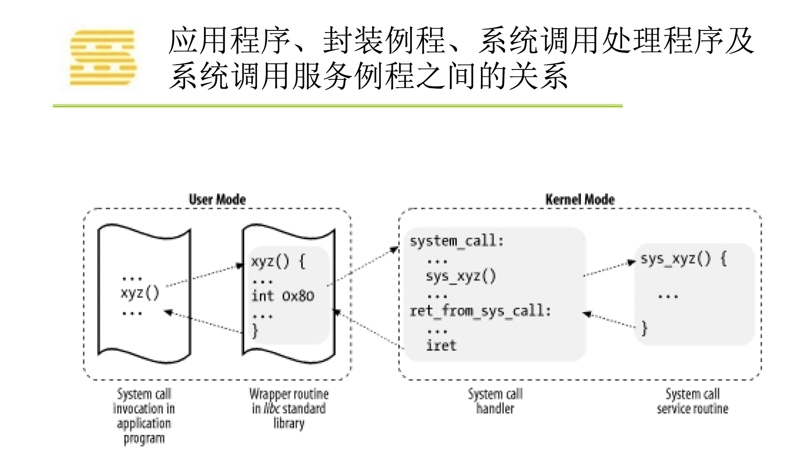

### Linux内核分析—04-系统调用的三层皮

1. 用户程序、glibc、系统调用中断处理函数以及系统调用之间的关系

   

   

2. 系统调用传参

   

3. 系统调用实例

   

   ​	下面那段汇编代码的含义：

   		- 把time系统调用的第一个参数0放到ebx寄存器：```mov $0, %%ebx\n\t```
   		- 设置系统调用号到寄存器eax：```mov $0xd,%%eax\n\t ```
   		- 触发中断：```int $0x80\n\t```
   		- 把系统调用的返回值（被放在eax寄存器里）拷贝至第一个输出变量：```mov %%eax, %0\n\t```
   		- 这段汇编的输出为tt变量的内存地址：```:"=m"(tt)```

4. 

