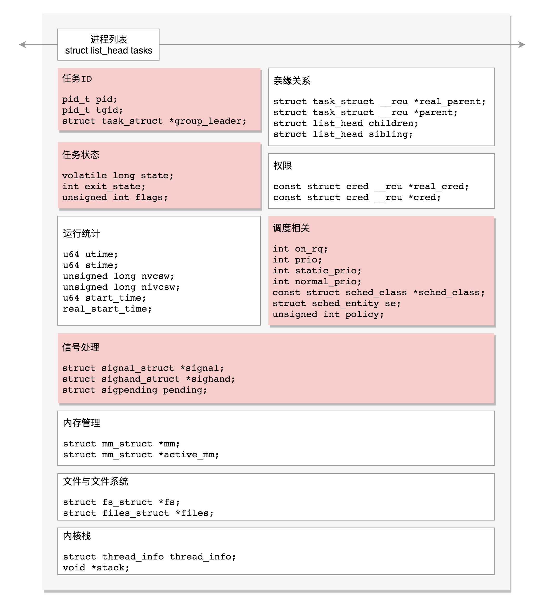

### Linux内核分析—05-进程描述

整体参考：https://time.geekbang.org/column/article/93014

1. 进程列表

   

2. 进程状态

   

3. 进程结构

   其中：

   	* thread_info：跟体系结构有关的CPU相关信息
   	* stack：内核栈

   

4. 进程用户栈和内核栈

   

   * 32位的函数调用时，被调用函数的参数是放在调用者的栈中；64位不一样，被调用者的参数是放在6个寄存器里，然后被调用者自行push到自己的栈中
   * 

5. 进程结构详细描述

   \- 内核中进程, 线程统一为任务, 由 taks_struct 表示
   \- 通过链表串起 task_struct
   \- task_struct 中包含: 任务ID; 任务状态; 信号处理相关字段; 调度相关字段; 亲缘关系; 权限相关; 运行统计; 内存管理; 文件与文件系统; 内核栈;
   \- 任务 ID; 包含 pid, tgid 和 \*group_leader
     \- pid(process id, 线程的id); tgid(thread group id, 所属进程[主线程]的id); group_leader 指向 tgid 的结构体
     \- 通过对比 pid 和 tgid 可判断是进程还是线程
   \- 信号处理, 包含阻塞暂不处理; 等待处理; 正在处理的信号
     \- 信号处理函数默认使用用户态的函数栈, 也可以开辟新的栈专门用于信号处理, 由 sas_ss_xxx 指定
     \- 通过 pending/shared_pending 区分进程和线程的信号
   \- 任务状态; 包含 state; exit_state; flags
     \- 准备运行状态 TASK_RUNNING
     \- 睡眠状态：可中断; 不可中断; 可杀
       \- 可中断 TASK_INTERRUPTIBLE, 收到信号要被唤醒
       \- 不可中断 TASK_UNINTERRUPTIBLE, 收到信号不会被唤醒, 不能被kill, 只能重启
       \- 可杀 TASK_KILLABLE, 可以响应致命信号, 由不可中断与 TASK_WAKEKILL 组合
     \- 停止状态 TASK_STOPPED, 由信号 SIGSTOP, SIGTTIN, SIGTSTP 与 SIGTTOU 触发进入
     \- 调试跟踪 TASK_TRACED， 被 debugger 等进程监视时进入
     \- 结束状态(包含 exit_state)
       \- EXIT_ZOMBIE, 父进程还没有 wait()
       \- EXIT_DEAD, 最终状态
     \- flags, 例如 PF_VCPU 表示运行在虚拟 CPU 上; PF_FORKNOEXEC \_do_fork 函数里设置, exec 函数中清除
   \- 进程调度; 包含 是否在运行队列; 优先级; 调度策略; 可以使用那些 CPU 等信息.

6. 进程栈详细描述

   \- 用户态/内核态切换执行如何串起来
   \- 用户态函数栈; 通过 JMP + 参数 + 返回地址 调用函数
     \- 栈内存空间从高到低增长
     \- 32位栈结构: 栈帧包含 前一个帧的 EBP + 局部变量 + N个参数 + 返回地址
       \- ESP: 栈顶指针; EBP: 栈基址(栈帧最底部, 局部变量起始)
       \- 返回值保存在 EAX 中
     \- 64位栈结构: 结构类似
       \- rax 保存返回结果; rsp 栈顶指针; rbp 栈基指针
       \- 参数传递时, 前 6个放寄存器中(再由被调用函数 push 进自己的栈, 用以寻址), 参数超过 6个压入栈中
   \- 内核栈结构:
     \- Linux 为每个 task 分配了内核栈, 32位(8K), 64位(16K)
     \- 栈结构: [预留8字节 +] pt_regs + 内核栈 + 头部 thread_info
     \- thread_info 是 task_struct 的补充, 存储于体系结构有关的内容
     \- pt_regs 用以保存用户运行上下文, 通过 push 寄存器到栈中保存
     \- 通过 task_struct 找到内核栈
       \- 直接由 task_struct 内的 stack 直接得到指向 thread_info 的指针
     \- 通过内核栈找到 task_struct
       \- 32位 直接由 thread_info 中的指针得到
       \- 64位 每个 CPU 当前运行进程的 task_struct 的指针存放到 Per CPU 变量 current_task 中; 可调用 this_cpu_read_stable 进行读取
